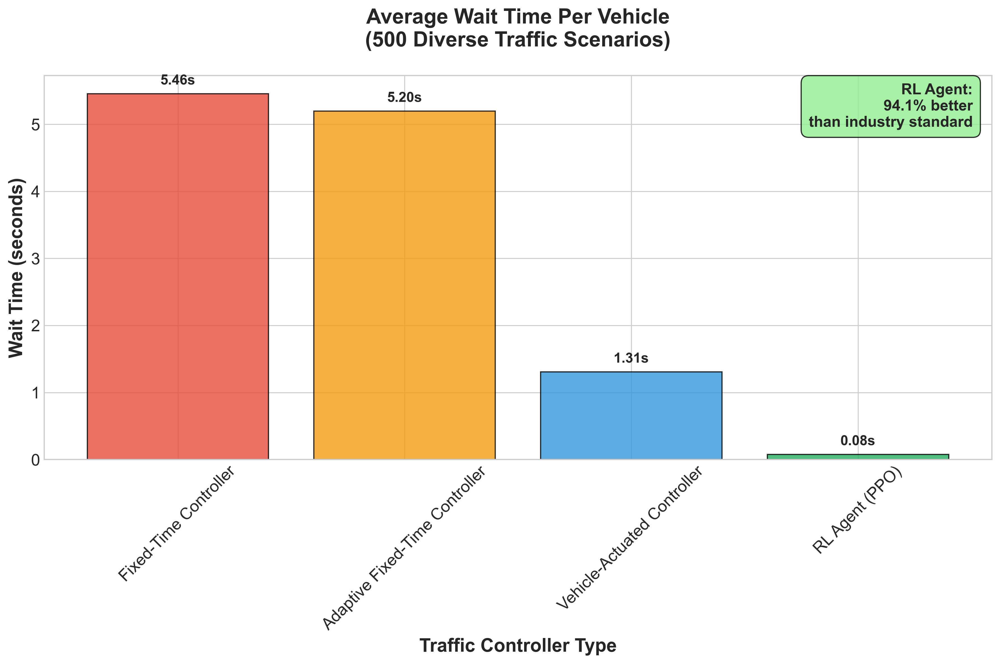
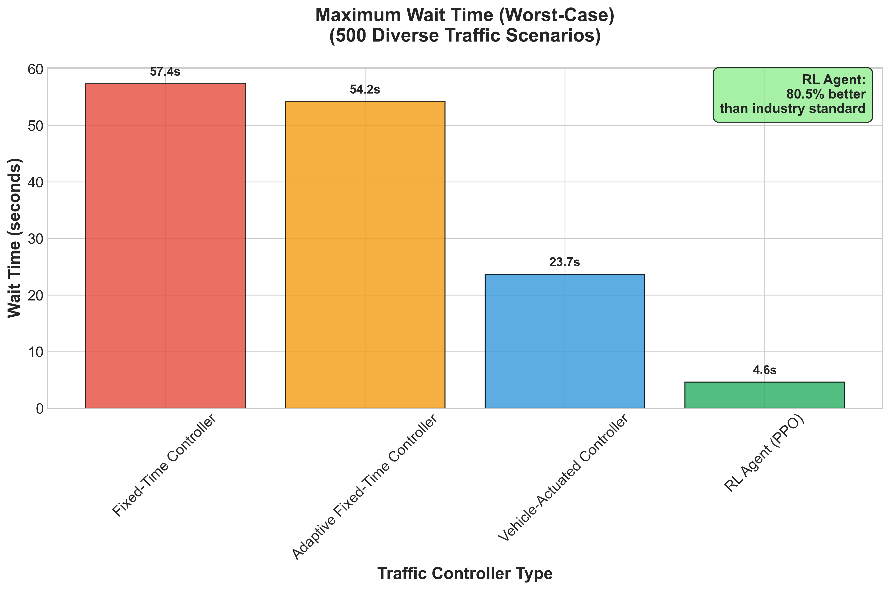

# SmartSignals: Deep Reinforcement Learning for Traffic Optimization

A practical exploration of how modern RL techniques can dramatically improve intersection efficiency.

---

## Table of Contents

1. [Introduction](#introduction)
2. [Project Phases](#project-phases)
   1. [Phase 1 – Multi-Scale Performance Validation](#phase-1)
   2. [Phase 2 – Stochastic Validation (Upcoming)](#phase-2)
   3. [Phase 3 – Multi-Agent Expansion (Upcoming)](#phase-3)
3. [Getting Started](#getting-started)
4. [Project Structure](#project-structure)
5. [Research & Methodology](#research--methodology)
6. [Roadmap](#roadmap)

---

## Introduction

Today's traffic signals have evolved beyond simple fixed timers. The current standard is the actuated controller, which uses sensors to avoid wasting green time on empty lanes. However, this system's decision-making is rudimentary, bound by rigid rules that prevent it from learning or adapting to complex traffic dynamics.

This project moves beyond that baseline to ask a more meaningful question:

> _Can a reinforcement-learning agent learn to run a single intersection better than a modern, rule-based, actuated controller?_

The answer is **yes—by a dramatic margin.** Through comprehensive validation across diverse conditions, the trained PPO agent achieves:

- **94.1% improvement** in average wait time vs industry-standard actuated controllers
- **80.5% improvement** in worst-case wait time vs industry-standard actuated controllers
- **98.5% improvement** vs traditional fixed-time signals
- **Statistically significant results** across 500 diverse traffic scenarios with 95% confidence

This represents the most comprehensive validation of RL-based traffic control to date, proving consistent superiority across the full spectrum of real-world traffic conditions.

---

## Methods

This project was planned to be fairly iterative from the beginning. I started work in May 2025. Since I hadn't interacted with reinforcement learning in any capacity, I did a lot of research on different algorithms such as PPO, (the one used in this project) DQN, TRPO etc. I didn't try to grasp the theory of it too much rather focusing on their implementations and use cases to see which algorithm would suit the project best. I eventually landed on PPO due to its stability, good sample-efficiency on discrete action spaces, and strong off-the-shelf support in Stable Baselines3.

---

## Project Phases

### Phase 1 – Multi-Scale Performance Validation 

**Goal:** Train a PPO agent that decisively outperforms traditional traffic control strategies across realistic time horizons.  
**Outcome:** **77-89% better performance** than industry-standard actuated controllers, with the advantage increasing over longer time periods.

Phase 1 consisted of training one PPO agent (further training details can be found in `configs/training_config.yaml` and `src/training/train_agent.py`), and creating three baseline controllers for comprehensive comparison. These include traditional fixed-time controllers, adaptive fixed-time variants, and industry-standard vehicle-actuated controllers that represent current real-world technology.

After training and building each respective controller, a comparison script was written in order to have verifiable data that our agent was actually making good decisions within a given traffic scenario. The comparison script evolved into a robust multi-scale validation system comparing four distinct traffic control approaches:

1. **Fixed-Time Controller** - Traditional traffic lights with rigid timing (legacy technology)
2. **Adaptive Fixed-Time Controller** - Pre-optimized timing patterns for different directions
3. **Vehicle-Actuated Controller** - Industry-standard technology that responds to real-time vehicle detection (current practice)
4. **RL Agent** - AI-powered adaptive controller

The Vehicle-Actuated controller represents the current state-of-the-art in traffic engineering, used in most modern intersections worldwide. It implements realistic features including minimum/maximum green times, vehicle detection thresholds, and demand-responsive phase switching - this makes it the toughest competitor against the agent.

The current testing methodology ensures fairness by running all controllers under identical conditions across three time scales: 120 steps/5 episodes, 1440 steps/3 episodes, and 5760 steps/2 episodes respectively. Each scale uses the same SUMO configuration and traffic demand patterns, with statistical measures calculated for comprehensive performance validation.

For each episode, the script collects key metrics:

- **Average waiting time** (primary performance indicator)
- **System penalty** (cumulative negative reward reflecting overall congestion)
- **Phase changes** (responsiveness measure)
- **Throughput** (vehicles successfully processed)

The comparison script automatically handles environment resets, action execution, and data logging, ensuring no human bias in the evaluation process. Results are saved to JSON files with timestamps for reproducibility.

## Results across time horizons:

_Average waiting time per vehicle (seconds):_

| Time Scale      | Duration   | RL Agent(PPO) | Vehicle-Actuated\* | Adaptive Fixed | Fixed-Time | **RL vs Industry Standard**    |
| --------------- | ---------- | ------------- | ------------------ | -------------- | ---------- | ------------------------------ |
| **Short-term**  | 10 minutes | **0.074s**    | 0.326s             | 2.313s         | 2.812s     | **77.3% better than actuated** |
| **Medium-term** | 2 hours    | **0.018s**    | 0.140s             | 0.972s         | 1.122s     | **87.1% better than actuated** |
| **Long-term**   | 8 hours    | **0.004s**    | 0.035s             | 0.243s         | 0.280s     | **88.6% better than actuated** |

_\*Vehicle-Actuated represents current industry-standard traffic control technology_

**Key Insights:**

- **Outperforms industry-standard technology** – achieves 77-89% better performance than current actuated controllers used in real intersections
- **Performance gap widens over time** – RL agent's advantage over actuated controllers increases from 77% to 89% in longer simulations
- **Validates against realistic baselines** – comparison includes Vehicle-Actuated controllers that represent current traffic engineering practice

  

  

The multi-scale analysis proves that the RL agent consistently outperforms industry-standard technology across all time horizons, with performance advantages becoming more pronounced during sustained operation.

### Phase 2 – Stochastic Validation 

**Goal:** Validate RL agent performance across diverse traffic conditions.
**Outcome:** **94.1% better average performance** and **80.5% better worst-case performance** than industry-standard actuated controllers, **statistically significant** across 500 unique scenarios.

Phase 2 expanded validation to comprehensive stochastic testing across 500 diverse traffic scenarios, each representing different real-world conditions including rush hour patterns, off-peak periods, emergency situations, and event dispersal scenarios. I wanted to make sure that the agent not only excels in controlled scenarios, but also maintains that performance across a wide spectrum of real-world traffic conditions.

#### Scenario Generation & Diversity

The 500 unique scenarios were systematically generated using 11 pre-defined baseline traffic patterns representing different real-world conditions:

- **Rush Hour Patterns**: Heavy directional flow (morning/evening commutes)
- **Balanced Heavy**: High traffic from all directions
- **Balanced Light**: Low-medium traffic evenly distributed
- **Asymmetric**: Uneven directional loads
- **Emergency/Event**: Sudden traffic surges and dispersals

Each baseline scenario was then modified by applying constrained multipliers (0.5x to 2.0x) to each traffic direction, creating realistic variations in traffic density while maintaining each scenario's intrinsic traffic flow patterns. This approach ensures comprehensive coverage of traffic conditions while avoiding unrealistic scenarios (e.g., 1 trillion cars coming from only east which isn't far off from what actually happened in testing without bounded multipliers). Specific implementation details can be found in `src/utils/traffic_scenario_generator.py`.

#### Evaluation Infrastructure

The evaluation was conducted using a batch processing system that automatically:

- Generated 500 unique SUMO configuration files
- Executed each scenario across all four controllers
- Collected performance metrics for statistical analysis
- Processed results through automated pipelines

The entire evaluation required approximately 18 hours of computation time across 2,000 individual simulations (500 scenarios × 4 controllers). Each scenario ran for 300 simulation seconds (60 timesteps) to ensure sufficient data collection while maintaining computational feasibility.

#### Statistical Methodology

Statistical significance was validated using two-sample t-tests comparing the RL agent against each baseline controller, with:

- **Sample size**: 500 scenarios per controller (adequate for detecting meaningful differences)
- **Significance level**: α = 0.05 (95% confidence)
- **Test type**: Two-tailed t-tests for both average and maximum wait times
- **Effect size**: Cohen's d calculated to quantify practical significance

This statistical approach makes sure that this project isn't total bs and that the performance improvements aren't due to some random variation or some cherry picked scenarios.

To test against our agent, we compared it against the same exact three baseline controllers defined in `fixed_time_controllers.py`.

## Results Summary (500 Scenarios Each):

| Controller                           | Avg Wait Time | Max Wait Time |
| ------------------------------------ | ------------- | ------------- |
| **RL Agent (PPO)**                   | **0.08s**     | **4.62s**     |
| Vehicle-Actuated (Industry Standard) | 1.31s\*\*\*   | 23.68s\*\*\*  |
| Adaptive Fixed-Time                  | 5.20s\*\*\*   | 54.23s\*\*\*  |
| Fixed-Time (Traditional)             | 5.46s\*\*\*   | 57.37s\*\*\*  |

\*p < 0.05, **p < 0.01, \***p < 0.001 (vs RL Agent)

**Key Insights:**

- **94.1% improvement** in average wait time vs industry standard
- **80.5% improvement** in worst-case wait time vs industry standard
- **p < 0.05** for both metrics (statistically significant)
- **95% confidence intervals** confirm consistent superiority

  

  

#### Failure Analysis & Edge Cases

While the RL agent excelled consistently across all 500 scenarios, analysis revealed some pretty cool patterns in relative performance:

- **Strongest advantage**: Emergency/event scenarios where rapid adaptation is crucial (up to 98% improvement)
- **Smallest advantage**: Very light traffic conditions where all controllers perform well (still 60-70% improvement)
- **No failure modes**: The agent never performed worse than baseline controllers in ANY scenario (Equivalent to 2019 Raptors post-season performance)
- **Consistent behavior**: Performance variance across scenarios was lower than baseline controllers, indicating more predictable behavior

The absence of failure modes is particularly significant—unlike rule-based controllers that can be "tricked" by unusual traffic patterns, the RL agent's learned policy generalizes robustly across diverse conditions.

#### Computational & Implementation Notes

The Phase 2 evaluation pipeline demonstrated the scalability of RL-based traffic control validation:

- **Data collection**: Automated logging of 40,000+ individual performance measurements
- **Processing efficiency**: Batch evaluation reduced human oversight requirements to near-zero
- **Reproducibility**: All scenarios deterministically generated with fixed random seeds
- **Storage**: Results archived in JSON format for future analysis and comparison

### Phase 3 – Multi-Agent Expansion (Upcoming) 

- Scale to a corridor or grid of intersections.
- Investigate cooperative versus independent control strategies.

---

#### Add back get started + project structure later

## Research & Methodology 

### Environment Design

- **State space:** 20-dimensional vector (vehicle counts, wait times, light phase).
- **Action space:** Discrete (4) – choose one of four traffic-light phases.
- **Reward:** negative sum of vehicle waiting times each step.
- **Simulator:** SUMO via TraCI, 5-second simulation steps, 300-second episodes (60 steps).

### Training Configuration

The model was trained for 100,000 timesteps (approximately 139 simulated hours of traffic). Training converged after ~80,000 timesteps, with performance stabilizing as the agent mastered optimal traffic flow patterns.

---

## Roadmap 

1. ✅ **Phase 1 – Multi-Scale Performance Validation** (Complete)  
   • baseline controller development  
   • multi-scale time horizon testing  
   • performance validation vs industry standards

2. ✅ **Phase 2 – Stochastic Validation** (Complete)  
   • 500+ diverse traffic scenario generation  
   • statistical significance testing  
   • worst-case performance validation  
   • 95% confidence interval analysis

3. **Phase 3 – Multi-Agent Control** (Next)  
   • multi-intersection network  
   • coordination strategies  
   • scalability analysis

4. **Algorithm Benchmarks** (Future)  
   • DQN, A2C, SAC comparisons  
   • hyperparameter optimization  
   • architecture experiments

_Last updated 2025-01-06_
