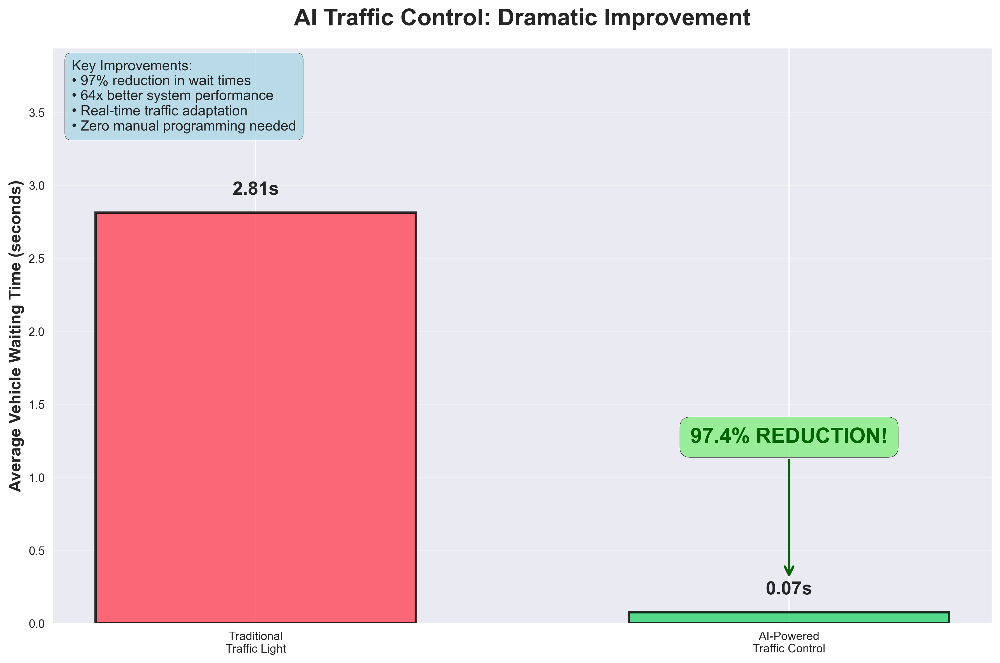

# SmartSignals: Deep Reinforcement Learning for Traffic Optimization

A practical exploration of how modern RL techniques can dramatically improve intersection efficiency.

---

## Table of Contents

1. [Introduction](#introduction)
2. [Project Phases](#project-phases)
   1. [Phase 1 – Single-Intersection Baseline](#phase-1)
   2. [Phase 2 – Stochastic Validation (Upcoming)](#phase-2)
   3. [Phase 3 – Multi-Agent Expansion (Upcoming)](#phase-3)
3. [Getting Started](#getting-started)
4. [Project Structure](#project-structure)
5. [Research & Methodology](#research--methodology)
6. [Roadmap](#roadmap)

---

## Introduction

Traditional traffic lights run on fixed schedules. They ignore real-time conditions, creating unnecessary stops, congestion, and emissions.  
This project asks a simple question:

> _Can a reinforcement-learning agent learn to run a single intersection better than a hand-crafted, static, schedule?_

The answer (so far) is **yes—by a wide margin.**

---

## Methods

This project was planned to be iterative from the beginning. I started work in May 2025, since I hadn't interacted with reinforcement learning in any capacity, I did a lot of reading on different algorithms such as PPO, (the one initially used in this project) DQN, TRPO etc. I didn't try to grasp the theory of it too much rather their implementations and use cases to see which algorithm would suit the project best. I eventually landed on PPO due to its stability, good sample-efficiency on discrete action spaces, and strong off-the-shelf support in Stable Baselines3.

---

## Project Phases

### Phase 1 – Single-Intersection Baseline <a name="phase-1"></a>

- Goal: Train a PPO agent that decisively outperforms traditional fixed-time controllers on a single four-way intersection.
- Outcome: **97 % reduction** in average vehicle wait time and **64×** better reward signal.

Phase 1 consisted of training one PPO agent (training details found here <- need to link training config later in readme), and creating two baseline controllers. The first baseline controller was on a fixed time schedule (30s green each direction creating a 2 minute schedule) and the other a slightly smarter fixed-time controller with different timing patterns allowing for asymmetric timing (e.g., longer green for busy directions, this is the one that most closely mimics real traffic lights).

After training and building each respective controller, a comparison script was written in order to have verifiable data that our agent was actually making good decisions within a given traffic scenario.

The testing methodology ensures fairness by running all three controllers under identical conditions: same SUMO configuration, same traffic demand patterns, and same episode lengths (120 steps = 10 minutes of simulated traffic). Each controller is evaluated across 5 independent episodes to capture performance consistency and calculate statistical measures.

For each episode, the script collects key metrics:

- **Average waiting time** (primary performance indicator)
- **System penalty** (cumulative negative reward reflecting overall congestion)
- **Phase changes** (responsiveness measure)
- **Throughput** (vehicles successfully processed)

The comparison script automatically handles environment resets, action execution, and data logging, ensuring no human bias in the evaluation process. Results are saved to JSON files with timestamps for reproducibility.

| Controller              | Avg Wait Time | System Penalty (lower better) | Phase Changes |
| ----------------------- | ------------: | ----------------------------: | ------------: |
| **RL Agent (PPO)**      |    **0.07 s** |                       **-31** |            23 |
| Adaptive Fixed-Time     |        2.31 s |                         ‑1571 |             3 |
| Fixed-Time (30 s cycle) |        2.81 s |                         ‑1992 |             3 |

> **Key takeaway:** the agent almost eliminates waiting while remaining highly responsive.

<p align="center">
  
</p>

Additional visualisations (bar, radar, episode plots) are available in `results/visualizations/phase_1` for deeper analysis.

### Phase 2 – Stochastic Validation (Upcoming) <a name="phase-2"></a>

- Generate 100 + traffic scenarios with varying demand patterns.
- Validate that improvements hold for worst-case (maximum) wait times.

### Phase 3 – Multi-Agent Expansion (Upcoming) <a name="phase-3"></a>

- Scale to a corridor or grid of intersections.
- Investigate cooperative versus independent control strategies.

---

## Getting Started <a name="getting-started"></a>

```bash
# clone repository
$ git clone https://github.com/yourusername/Smart_Signals.git
$ cd Smart_Signals

# install dependencies (Python 3.8+)
$ pip install -r requirements.txt

# run the Phase 1 comparison
$ python src/evaluation/compare_controllers.py

# generate the visualisations
$ python src/evaluation/create_visualizations.py
```

Training scripts (`src/training/`) allow you to retrain or experiment with alternative algorithms.

---

## Project Structure <a name="project-structure"></a>

```
Smart_Signals/
├── src/
│   ├── environments/   # SUMO-based Gymnasium environment
│   ├── agents/         # RL and baseline controllers
│   ├── training/       # Training scripts
│   └── evaluation/     # Comparison & visualisation tools
├── sumo_scenarios/     # Network / route definitions
├── results/            # Logged metrics & charts
└── models/             # Saved RL models (git-ignored)
```

---

## Research & Methodology <a name="research--methodology"></a>

### Environment Design

- **State space:** 20-dimensional vector (vehicle counts, wait times, light phase).
- **Action space:** Discrete (4) – choose one of four traffic-light phases.
- **Reward:** negative sum of vehicle waiting times each step.
- **Simulator:** SUMO via TraCI, 5-second simulation steps, 300-second episodes (60 steps).

### Training Configuration

The model was trained for 100,000 timesteps (approximately 139 simulated hours of traffic). Training converged after ~80,000 timesteps, with performance stabilizing as the agent mastered optimal traffic flow patterns.

---

## Roadmap <a name="roadmap"></a>

1. **Phase 2 – Stochastic Validation**  
   • traffic generator  
   • 100 + scenario benchmarking  
   • confidence intervals on max-wait reduction
2. **Phase 3 – Multi-Agent Control**  
   • multi-intersection network  
   • coordination strategies  
   • scalability analysis
3. **Algorithm Benchmarks** (DQN, A2C, SAC, etc.)

_Last updated 2025-07-01_
