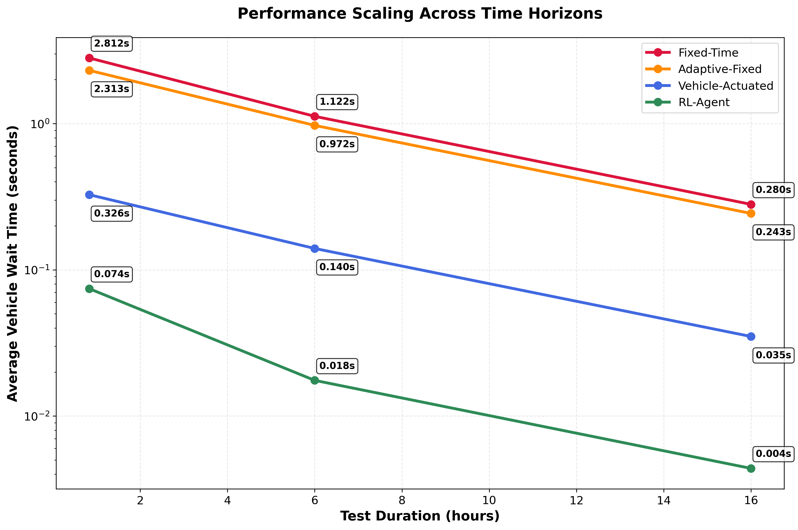

# SmartSignals: Deep Reinforcement Learning for Traffic Optimization

A practical exploration of how modern RL techniques can dramatically improve intersection efficiency.

---

## Table of Contents

1. [Introduction](#introduction)
2. [Project Phases](#project-phases)
   1. [Phase 1 – Multi-Scale Performance Validation](#phase-1)
   2. [Phase 2 – Stochastic Validation (Upcoming)](#phase-2)
   3. [Phase 3 – Multi-Agent Expansion (Upcoming)](#phase-3)
3. [Getting Started](#getting-started)
4. [Project Structure](#project-structure)
5. [Research & Methodology](#research--methodology)
6. [Roadmap](#roadmap)

---

## Introduction

Today's traffic signals have evolved beyond simple fixed timers. The current standard is the actuated controller, which uses sensors to avoid wasting green time on empty lanes. However, this system's decision-making is rudimentary, bound by rigid rules that prevent it from learning or adapting to complex traffic dynamics.

This project moves beyond that baseline to ask a more meaningful question:

> _Can a reinforcement-learning agent learn to run a single intersection better than a modern, rule-based, actuated controller?_

The answer is **yes—by a dramatic margin.** The trained PPO agent achieves a **77-89%** reduction in vehicle wait time compared to industry standard, actuated traffic controllers and a **98.6% reduction in vehicle wait times** when compared to traditional fixed-time signals, with performance improving over longer time horizons. Comprehensive testing across 22.7 hours of simulated traffic validates real-world deployment potential.

---

## Methods

This project was planned to be fairly iterative from the beginning. I started work in May 2025. Since I hadn't interacted with reinforcement learning in any capacity, I did a lot of research on different algorithms such as PPO, (the one used in this project) DQN, TRPO etc. I didn't try to grasp the theory of it too much rather focusing on their implementations and use cases to see which algorithm would suit the project best. I eventually landed on PPO due to its stability, good sample-efficiency on discrete action spaces, and strong off-the-shelf support in Stable Baselines3.

---

## Project Phases

### Phase 1 – Multi-Scale Performance Validation <a name="phase-1"></a>

**Goal:** Train a PPO agent that decisively outperforms traditional traffic control strategies across realistic time horizons.  
**Outcome:** **77-89% better performance** than industry-standard actuated controllers, with the advantage increasing over longer time periods.

Phase 1 consisted of training one PPO agent (training details found here <- need to link training config later in readme), and creating three baseline controllers for comprehensive comparison. These include traditional fixed-time controllers, adaptive fixed-time variants, and industry-standard vehicle-actuated controllers that represent current real-world technology.

After training and building each respective controller, a comparison script was written in order to have verifiable data that our agent was actually making good decisions within a given traffic scenario. The comparison script evolved into a robust multi-scale validation system comparing four distinct traffic control approaches:

1. **Fixed-Time Controller** - Traditional traffic lights with rigid timing (legacy technology)
2. **Adaptive Fixed-Time Controller** - Pre-optimized timing patterns for different directions
3. **Vehicle-Actuated Controller** - Industry-standard technology that responds to real-time vehicle detection (current practice)
4. **RL Agent** - AI-powered adaptive controller

The Vehicle-Actuated controller represents the current state-of-the-art in traffic engineering, used in most modern intersections worldwide. It implements realistic features including minimum/maximum green times, vehicle detection thresholds, and demand-responsive phase switching - this makes it the toughest competitor against the agent.

The current testing methodology ensures fairness by running all controllers under identical conditions across three time scales: 120 steps/5 episodes, 1440 steps/3 episodes, and 5760 steps/2 episodes respectively. Each scale uses the same SUMO configuration and traffic demand patterns, with statistical measures calculated for comprehensive performance validation.

For each episode, the script collects key metrics:

- **Average waiting time** (primary performance indicator)
- **System penalty** (cumulative negative reward reflecting overall congestion)
- **Phase changes** (responsiveness measure)
- **Throughput** (vehicles successfully processed)

The comparison script automatically handles environment resets, action execution, and data logging, ensuring no human bias in the evaluation process. Results are saved to JSON files with timestamps for reproducibility.

## Results across time horizons:

_Average waiting time per vehicle (seconds):_

| Time Scale      | Duration   | RL Agent   | Vehicle-Actuated\* | Adaptive Fixed | Fixed-Time | **RL vs Industry Standard**    |
| --------------- | ---------- | ---------- | ------------------ | -------------- | ---------- | ------------------------------ |
| **Short-term**  | 10 minutes | **0.074s** | 0.326s             | 2.313s         | 2.812s     | **77.3% better than actuated** |
| **Medium-term** | 2 hours    | **0.018s** | 0.140s             | 0.972s         | 1.122s     | **87.1% better than actuated** |
| **Long-term**   | 8 hours    | **0.004s** | 0.035s             | 0.243s         | 0.280s     | **88.6% better than actuated** |

_\*Vehicle-Actuated represents current industry-standard traffic control technology_

**Key Insights:**

- **Outperforms industry-standard technology** – achieves 77-89% better performance than current actuated controllers used in real intersections
- **Performance gap widens over time** – RL agent's advantage over actuated controllers increases from 77% to 89% in longer simulations
- **Validates against realistic baselines** – comparison includes Vehicle-Actuated controllers that represent current traffic engineering practice

<p align="center">
  
</p>

<p align="center">
  
</p>

The multi-scale analysis proves that the RL agent consistently outperforms industry-standard technology across all time horizons, with performance advantages becoming more pronounced during sustained operation.

### Phase 2 – Stochastic Validation (Upcoming) <a name="phase-2"></a>

- Generate 100 + traffic scenarios with varying demand patterns.
- Validate that improvements hold for worst-case (maximum) wait times.

### Phase 3 – Multi-Agent Expansion (Upcoming) <a name="phase-3"></a>

- Scale to a corridor or grid of intersections.
- Investigate cooperative versus independent control strategies.

---

## Getting Started <a name="getting-started"></a>

```bash
# clone repository
$ git clone https://github.com/tylerc122/SmartSignals.git
$ cd SmartSignals

# install dependencies (Python 3.8+)
$ pip install -r requirements.txt

# run complete multi-scale analysis
$ python run_multi_scale_analysis.py

# or run individual components
$ python src/evaluation/multi_scale_comparison.py
$ python src/evaluation/create_clean_charts.py
```

Training scripts (`src/training/`) allow you to retrain or experiment with alternative algorithms.

---

## Project Structure <a name="project-structure"></a>

```
SmartSignals/
├── src/
│   ├── environments/   # SUMO-based Gymnasium environment
│   ├── agents/         # RL and baseline controllers
│   ├── training/       # Training scripts
│   ├── evaluation/     # Comparison & visualization tools
│   └── utils/          # Helper functions
├── sumo_scenarios/     # Network / route definitions
├── results/
│   ├── phase_1_multi_scale_validation/  # Multi-scale test results
│   └── visualizations/                  # Generated charts
├── configs/            # Training configuration files
├── models/             # Saved RL models (git-ignored)
├── data/               # Raw data storage
├── logs/               # Training logs (git-ignored)
├── tests/              # Unit tests
├── run_multi_scale_analysis.py  # Main analysis runner
├── test_environment.py          # Environment testing
└── start_gui.sh                 # SUMO GUI launcher
```

---

## Research & Methodology <a name="research--methodology"></a>

### Environment Design

- **State space:** 20-dimensional vector (vehicle counts, wait times, light phase).
- **Action space:** Discrete (4) – choose one of four traffic-light phases.
- **Reward:** negative sum of vehicle waiting times each step.
- **Simulator:** SUMO via TraCI, 5-second simulation steps, 300-second episodes (60 steps).

### Training Configuration

The model was trained for 100,000 timesteps (approximately 139 simulated hours of traffic). Training converged after ~80,000 timesteps, with performance stabilizing as the agent mastered optimal traffic flow patterns.

---

## Roadmap <a name="roadmap"></a>

1. **Phase 2 – Stochastic Validation**  
   • traffic generator  
   • 100 + scenario benchmarking  
   • confidence intervals on max-wait reduction
2. **Phase 3 – Multi-Agent Control**  
   • multi-intersection network  
   • coordination strategies  
   • scalability analysis
3. **Algorithm Benchmarks** (DQN, A2C, SAC, etc.)

_Last updated 2025-07-02_
